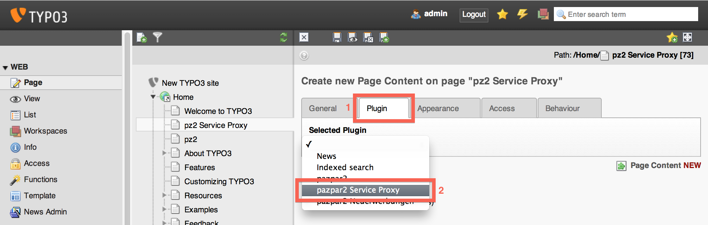

# Example Setup
This file gives a step-by-step example for setting up your webserver and TYPO3 for successful use of the _pazpar2 Service Proxy_ plug-in.

## Set up reverse proxies in apache
Your Service Proxy needs to be accessible at a path on your site’s host name so scripts on the page can access it. Apache allows several ways of doing this. Using mod_proxy you can add the following lines to the setup of your site or virtual host:

	ProxyPass        /service-proxy http://service-proxy.com/service-proxy/
	ProxyPass        /service-proxy-auth http://service-proxy.com/service-proxy-auth

where http://service-proxy.com/service-proxy and http://service-proxy.com/service-proxy-auth need to be replaced by the address of your Service Proxy and Service Proxy Authentication URLs. This will make the services at the paths `/service-proxy` and `/service-proxy-auth` on your server which are the default setup the TYPO3 plug-in uses.

After adding these settings to your apache configuration, restart apache and make sure you get replies on the URLs:

	> curl http://mysite.com/service-proxy-auth
	<response><status>OK</status>
	<displayName>MKC demo</displayName>
	<realm>mkc_demo</realm>
	<realmAttributes><realm>admin.admin</realm>
	<lastModified>Mon, 22 Apr 2013 17:15:48 UTC</lastModified>
	<creationDate>Thu, 03 Jan 2013 19:57:43 UTC</creationDate>
	<superuser>1</superuser>
	</realmAttributes>
	<proxyUrl></proxyUrl>
	<type>credentials</type>
	<iconUrl></iconUrl>
	<proxyPattern></proxyPattern>
	<hasPatronInfo>no</hasPatronInfo>
	</response>

	> curl http://mysite.com/service-proxy/
	<error code="102" msg="BAD REQUEST">Missing &apos;command&apos; parameter</error>%

The error message on the second query is OK at this stage as this is not a proper Service Proxy setup.

## Install the pazpar2 Extension in TYPO3
* Make sure you have TYPO3 ≥ 4.5.27
* Log into your TYPO3 Backend as an admin
* Go to the Extension manager and add the extension: either from the TYPO3 Extension Repository or by uploading the .t3x file you have
* Click the »+« Install Extension… icon for the pazpar2 Extension  
	
* TYPO3 may suggest installing additional extensions at this stage:
	* t3jquery: We recommend using the t3jquery extension to handle inserting jQuery on your site. If you already include jQuery, you can ignore it
	* nkwgok: This is only required for the »pazpar2 Neuerwerbungen« plug-in, you can ignore it for this setup
	* typo3: TYPO3 4.5 will erroneously suggest this, you can ignore it

## Set up the pazpar2 Extension’s template for your site
* Select the »Template« module in the left sidebar
* Select the home page (or single page you want to use the plug-in on) in the page list
* Ensure you are on the »Info/Modify« mode in the main pane
* Click »Edit the whole template record«
* 
* Select the »Includes« tab
* Select the »Include Static Tamplates After Basis Templates« checkbox (depending on your setup this may not be necessary)
* Find and click the »pazpar2 Settings (pazpar2)« item in the list »Available Items« (most likely at the very bottom)
* The »pazpar2 Settings (pazpar2)« item will appear in the list »Selected Items
* Click the floppy disk »Save« icon at the top
* 

## Ensure jQuery is available on your site
Either by including the relevant script files yourself. Or by using the t3jquery TYPO3 extension. It needs to be configured to provide basic
»jQuery«. In case you want to use autocomplete, the jQuery UI modules Autocomplete, Menu and Position as well as a jQuery UI CSS theme need to be inlcuded in the site.

_Add step-by-step instructions?_

## Add the pazpar2 Service Proxy content element to a page
* Select the »Page« module in the left sidebar
* Select the Page you want to use pazpar2 Service Proxy on
* Add a content element to the main content column
* 
* Click the »Plugins« tab
* Click »General Plugin«
* 
* Click the »Plugin« tab
* In the »Selected plugin« popup menu: select the »pazpar2 Service Proxy«
* 
* Click »OK« the dialogue TYPO3 displays
* Click the floppy disk »Save document« button
* Close the Content element

Now you should be able to preview or view the page with the pazpar2 Service Proxy plug-in and use it.

### Notes
* If search does not work in preview mode: a common issue is that your TYPO3 backend uses `https` and we only set up the proxy for `http` connections. Try removing the »s« or setting up the proxy for `https` as well.
* If the search form contains a note about JavaScript, this typicall indicates that jQuery did not load before the pazpar2 scripts or that the template setup for the extension did not insert the pazpar2 JavaScript files as expected.
* If you can configure the page/column width on your site, choose a column that’s as wide as possible for the content element.

